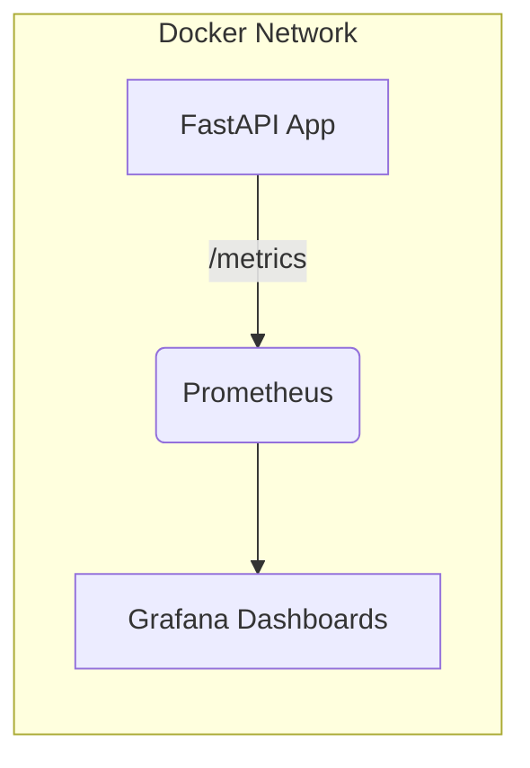

# 📡 Real-Time Observability Demo

A minimal end-to-end observability stack built with **FastAPI**, **Prometheus**, and **Grafana**.
The project demonstrates:

* Exposing **custom metrics**
* **Scraping & storing** them with Prometheus
* **Visualizing** them in Grafana
* Running everything with **Docker Compose**

This is ideal for learning observability concepts or bootstrapping custom monitoring solutions.

---

## 🚀 Features

* FastAPI service with:

  * Counter
  * Gauge
  * Histogram
  * A `/metrics` endpoint for Prometheus scraping
* Prometheus service for:

  * Metrics ingestion
  * Basic alerting-ready config
* Grafana service for:

  * Dashboards
  * Visualizations
  * Querying metrics
* One-command orchestration via Docker Compose

---

## 🧱 Architecture



---

## 📦 Project Structure

```
real-time-observability-demo/
│
├── app.py
├── requirements.txt
├── Dockerfile
├── prometheus.yml
└── docker-compose.yml
```

---

## 🧪 Local Development (without Docker)

Install deps:

```bash
pip install -r requirements.txt
```

Run the app:

```bash
uvicorn app:app --reload
```

Expose metrics at:

```
http://localhost:8000/metrics
```

---

# 📊 Prometheus Setup

### 1. Prometheus config file (`prometheus.yml`)

```yaml
global:
  scrape_interval: 5s

scrape_configs:
  - job_name: "app"
    static_configs:
      - targets: ["app:8000"]
```

### 2. Run Prometheus standalone (optional)

```bash
docker run -p 9090:9090 -v /absolute/path/prometheus.yml:/etc/prometheus/prometheus.yml prom/prometheus
```

Prometheus UI:

```
http://localhost:9090
```

---

# 📈 Grafana Setup

### Run Grafana

```bash
docker run -d -p 3000:3000 --name grafana \
  -e "GF_SECURITY_ADMIN_USER=admin" \
  -e "GF_SECURITY_ADMIN_PASSWORD=admin" \
  grafana/grafana
```

Grafana UI:

```
http://localhost:3000
```

### Add Prometheus as a data source

```
URL: http://prometheus:9090
```

### Create dashboards

Use any custom metric like:

```
custom_request_count_total
```

Or import a community dashboard (e.g., ID **3662**).

---

# 🐳 Running Everything with Docker Compose

This project ships with a full working Docker Compose setup.

### 1. `docker-compose.yml`

```yaml
version: "3.9"

services:
  app:
    build: .
    container_name: observability-app
    ports:
      - "8000:8000"
    networks:
      - observability

  prometheus:
    image: prom/prometheus
    container_name: prometheus
    volumes:
      - ./prometheus.yml:/etc/prometheus/prometheus.yml
    ports:
      - "9090:9090"
    networks:
      - observability

  grafana:
    image: grafana/grafana
    container_name: grafana
    environment:
      - GF_SECURITY_ADMIN_USER=admin
      - GF_SECURITY_ADMIN_PASSWORD=admin
    ports:
      - "3000:3000"
    depends_on:
      - prometheus
    networks:
      - observability

networks:
  observability:
    driver: bridge
```

---

### 2. Start all services

```bash
docker-compose up --build
```

Services:

* App → [http://localhost:8000](http://localhost:8000)
* Prometheus → [http://localhost:9090](http://localhost:9090)
* Grafana → [http://localhost:3000](http://localhost:3000)

---

### 3. Stop services

```bash
docker-compose down
```

---

# 📚 Next Steps

* Add **Prometheus alerting rules**
* Create **Grafana Alerts** (Slack, email)
* Expose latency/error metrics from real endpoints
* Create dashboards for:

  * Request rate (RPS)
  * Error rate
  * Latency histograms
* Add a service like **Loki** for logs

---

# 🤝 Contributing

Pull requests are welcome.
Feel free to open an issue for discussions, improvements, or enhancements.